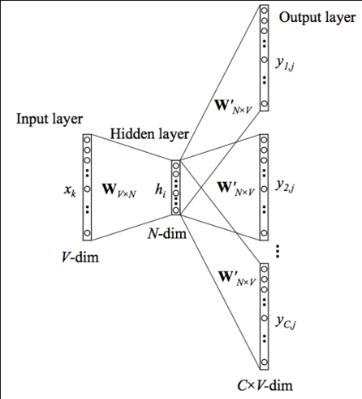

# Word2Vec

## Opening

* Word Embedding: 고차원의 데이터인 단어를 저차원의 데이터인 수치로 변환하는 작업
* 초기 one-hot-encoding 방식
  * ['나는', '배가', 고프다'] '배가'의 표현 벡터 -> [0, 1, 0]
  * 단어 간의 의미론적 차이, 연관 관계를 이해할 수 없음
* Word Embedding to Vector
  * 단어의 문맥상 의미 자체를 다차원 공간에 벡터화
  * 기법: NNLM, RNNLM, CBOW, Skip-gram

## CBOW

* Context로부터 찾고자 하는 Target을 예측하는 모델
  * cf) 나는 [Target]을 먹었다.
* 목표 단어 앞뒤로 C/2개씩 총 C개의 단어를 Input (C는 10 내외)
* 구문분석에 유용 (Syntactic)
  * 다수 단어의 분포상 정보를 바로잡는 효과 / 작은 dataset에서 유용

## Skip-gram

* Target으로 부터 Context를 예측/유추하는 모델
* 일정 size의 window 안에 있는 단어 쌍을 모두 업데이트
  * cf) 배고픈 나는 집에서 밥을 먹고 있습니다. -> (밥을, 나는), (밥을, 집에서), (밥을, 먹고) ...
* 의미분석에 유용 (Semantic)
  * 큰 dataset에서 유용

## Skip-gram 학습 과정

* hello, my name is bob. Nice to meet you.
  * window size 2
    * (hello, my), (hello, name)
    * (my, hello), (my, name), (my, is)
    * (name, hello), (name, my), (name, is), (name, bob)

* V는 Training-Data에 존재하는 단어의 개수. 벡터 xk는 V차원의 One-hot-vector
* W는 Input-Hidden Layer 사이의 가중치 행렬. V * N 크기를 가지게 됨
* W'는 Hidden-Output Layer 사이의 가중치 행렬. N * V 크기
* N은 Embedding-Size로 압축하고자 하는 차원
* C는 Context word의 수. window size가 n이면 C는 n*2
* h는 입력 벡터와 행렬 W의 내적. 입력 벡터가 One-hot-vector이기 때문에 목표 단어의 index에 해당하는 W의 행 값을 그대로 벡터 h로 copy.

* ycj는 xk가 주어졌을 때, 
